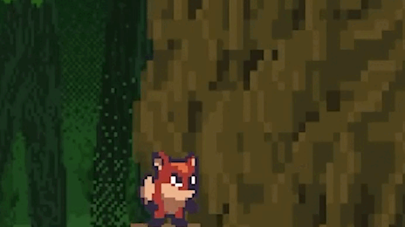
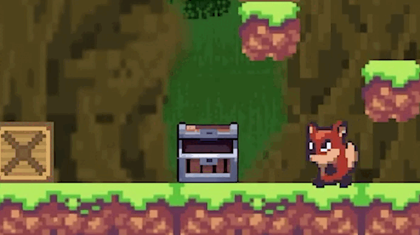

# FoxGame

## Навігація
- [Мета проекта](#title1)
- [Корисність проекта](#title2)
- [Як запустити гру](#title3)
- [Керування](#title0)
- [Додатки гри](#title4)
- [Структура проекта](#title5)
- [Як працює гра](#title6)
- [Висновок](#title7)

## <a id="title1">Мета проекту</a>
Мета проекту - розробка гри, яка б покращіла мої навички алгоритмичного мислення.
Знайомство з новими модулями, програмами та технологіями. Демонстрація, що можна
зробити з допомогою pygame. Мій перший повноцінний проект.

---

## <a id="title2">Чим мій проект може бути корисним для вас?</a>
Цей проект як рекомендація, щодо вибору першого проекту для розвитку та вступу у IT.
Я, як той, хто закінчив цей проект, можу з упевненістю сказати, що не шкодую витраченого часу.
Завдяки цьому проекту я почав розуміти всю суть програмування. Освоювати нові технології та модулі стало легше, 
завдяки витраченому часу на цей проект. Також якщо мій проект частково збігається з вашим, то ти можеш взяти 
відповідний шматочок коду для розвитку своєї гри.
---


## <a id="title3">Як запустити цю гру?</a>
1. Завантажити проект
    - git clone https://github.com/ArtemDema/FoxGame_2d.git
2. Перейти до папки з грою
    - cd FoxGame
3. Встановлення python
    - [встановлюємо Пайтон](https://www.python.org/downloads/)
4. Встановлення потрібних модулів для роботи гри
    - pip install -r requirements.txt
5. Запустити гру
    - запустити скрипт через файл main.py
---

## <a id="title0">Керування</a>
### A - йти у ліву сторону
### D - йти у праву сторону
### SPACE - стрибати
### Q - підняти ящік
### R(утримувати) - штовхати ящік
### G - бросити ящік
### T - завдання
### ESCAPE - пауза
### SHIFT - присід
---

## <a id="title4">Головні додатки гри</a>
### Pygame
Головний модуль, на якому працює гра
### PyTMX
Модуль, завдяки якому переноситься карта з .tmx файла у гру
### Figma
Програма, яка допомогала створювати дизайн рівнів та структуру проекта 
### Json файли
Тип файлів, які я використовував що б зберегати у них інформацію

---

## <a id="title5">Структура проекта</a>
[FigJam цього проекту](https://www.figma.com/board/B8v8JYXgKJuE30osFyJRUw/FoxGame?node-id=0-1&t=1NYW6Y12vcnziKrK-1)

### Images
Папка у якій знаходиться усі зображення, які використовуються у грі
### Json
Зберігає в собі json файл, у якому знаходиться інформація про останній захід у гру 
### Level task
Зберігає в собі json файл, у якому знаходиться інформація про задачі на конкретний рівень
### Levels
Зберігає в собі .tmx файл, у якому знаходиться частина першого рівня
### Modules
1. Box
    - Зберігає в собі всі функції та можливості коробок
2. Bush
    - Зберігає в собі всі функції та можливості кустів
3. Chest
    - Зберігає в собі всі функції та можливості скринь
4. Cloud
    - Зберігає в собі всі функції та можливості хмар
5. Enemy
    - Зберігає в собі всі функції та можливості ворогів, таких як жаба, курка, курча і півень
6. Game events and checks
    - Зберігає в собі перевірки завдяки яким працюють деякі функції гри
7. Interface
    - Зберігає в собі інвентар який показується угорі ігрового вікна
8. Json
    - Зберігає в собі функції для роботи та обробки json файлів
9. Modal window
    - Зберігає в собі код для показу, що було в скрині
10. Resources
    - Зберігає в собі всі функції для обробки ресурсів, які є у гравця
11. Screen
    - Зберігає в собі мапу, гравця, завантаження зображень, малювання всього, що є на екрані 
12. Tree
    - Зберігає в собі всі функції та можливості дерев
13. Water
    - Зберігає в собі всі функції та можливості води
14. Functions for main.py
    - Зберігає в собі функції для гравітації, штовхання ящика та стрибок
15. Main class.py
    - Зберігає в собі всі самі головні класи завдяки яким створена вся гра
16. Main meny.py
    - Зберігає в собі меню, яке показується при заході в гру
### Sounds
Зберігає в собі усі звуки, які використовуються у грі
### Main.py
Головний файл, через який гра повинна запускатись
### Requirements.txt
Зберігає в собі усі модулі, необхідні для роботи гри

---

## <a id="title6">Як працює ця гра</a>
### Move
#### Переміщення зроблено за допомогою перевірок на дотик до стін та ворогів,
#### якщо персонаж не доторкається до них, то гравець може йти в бік.
#### Ось шматочок з коду, з демонстраціею як це працює:
```python
if keys[pygame.K_a]:
    for enemy in list_enemy:
        answer = enemy.check_collision_right_wall(player.x, player.y + 5, 
                                                player.x + player.width, player.y + player.height)
        if answer:
            dict_return["last_side"] = 0
            return dict_return

    if answer != True:
        if move_jump == False:
            dict_return["move_left"] = True
        if push_box: dict_return["push_box"] = False
        dict_return["last_side"] = 0
        player.x -= player.speed
        player.rect.x -= player.speed
```
#### Як це виглядає у грі:

---
### Jump
#### Стрибок зроблено за допомогою перевірок на дотик до низу блоків,
#### якщо персонаж не доторкається до них, то гравець виконує стрибок
#### Ось шматочок з коду, з демонстраціею як це працює:
```python
if keys[pygame.K_SPACE]:
    if player.strength_jump != 0:
        for block in blocks:
            answer = block.check_collision_bottom_wall_p(player)
            if answer:
                return_dict["move_jump"] = False
                return_dict["player_strength_jump"] = 20
                return return_dict
        
        player.y -= player.speed * 1.5
        player.rect.y -= player.speed * 1.5
    else:
        return_dict["move_jump"] = False
        return_dict["player_strength_jump"] = 20
        return return_dict
```
#### Як це виглядає у грі:

---
### Crouch
#### Присідання зроблено за допомогою перевірок на стан гравця,
#### якщо персонаж не стрибає, не йде, не падає, то гравець може пригнутися
#### Ось шматочок з коду, з демонстраціею як це працює:
```python
if keys[pygame.K_LSHIFT]:
    if mod.move_bottom == False and mod.move_jump == False and mod.move_right == False and mod.move_left == False and mod.player.hide == False and mod.with_box == False:
        mod.move_crouch = True
else:
    mod.move_crouch = False
```
#### Як це виглядає у грі:

---
### Pause
#### Паузу зроблено за допомогою перевірки на натискання клавіши Escape,
#### якщо ця клавіша натиснута, то гра сповільнюється і з'являються дві кнопки(виходу та продовження) 
#### Ось шматочок з коду, з демонстраціею як це працює:
```python
if keys[pygame.K_ESCAPE]:
    pause = True
if pause:
    pygame.time.delay(120)
    exit_b = mod.Button(525, 450, 190, 100, "images/resources/exit.png")
    continue_b.show_image(mod.screen)
```
#### Як це виглядає у грі:

---
### Menu
#### Меню зроблено за допомогою такого ж самого циклу як і сама гра,
#### Перед початком гри запускається нескінечний цикл, вийти з якого можно лише натиснувши кнопку
#### Ось шматочок з коду, з демонстраціею як це працює:
```python
menu_run = True
while menu_run:
    for event in pygame.event.get():
        if event.type == pygame.MOUSEMOTION:
                position_mouse = event.pos

        if event.type == pygame.MOUSEBUTTONDOWN and event.button == 1:
            menu_run = button1.check_click(position_mouse[0], position_mouse[1])
            if menu_run == False:
                return True
    pygame.display.flip()
```
#### Як це виглядає у грі:

---
### Map
#### Мапу зроблено за допомогою модулю PyTMX(статичні блоки) та матриці(дерева, ресурси, вороги)
#### Ось шматочок з коду, з демонстраціею як це працює:
```python
path = os.path.abspath(__file__ + "\..\..\..\levels")

level = pytmx.load_pygame(path + "/first_screen.tmx")

layer = level.get_layer_by_name("Слой тайлов 1")

for x, y, tileSurface in layer.tiles():
    tile =  TileBlock(x = x * 50, y = y * 50, width = 50, height = 50, image = tileSurface)
    blocks.append(tile)

map = [ [" ","r"," ","b"," "," "," "] ]
for idy, row in enumerate(map):
    for idx, column in enumerate(row):       
        if column == "b":
            pass
        elif column == "r":
            pass
```
---
### Kill enemies
#### Ось шматочок з коду, з демонстраціею як це працює:
```python
#смерть від ящіка
if self.is_dead == False:
    for box in boxes:
        answer = box.check_collision_bottom_wall(self.x, self.y, #CHECK BOX FOR DEATH
                                                self.x + self.width, self.y + self.height)
        if answer:
            self.is_dead = True
            interface[4].count += 1
            task_enemy -= 1

#смерть від гравця
if bottom_y_p >= self.y:
    if left_x_p + 33 >= self.x:
        if right_x_p - 30 <= right_x:
            if top_y_p + 20 <= self.y:
                if bottom_y_p + 10 <= bottom_y:
                    self.is_dead = True
                    interface[4].count += 1
                    task_enemy -= 1
```
#### Як це виглядає у грі:


---
### Frog
#### Поведінка жаби - агресивна, може стрибати. Ось шматочок з коду, з демонстраціею як це працює:
```python
#стрибок
frog.x = self.x + 10 * math.cos(self.angle * (math.pi / 180))
frog.y = self.y + 10 * math.sin(self.angle * (math.pi / 180))

#агресивність
if self.player_visibility:
            if player.hide == False:
                if self.frequency_jump == 0:
                    if self.angle == 0:
                        distance = player.x - self.x
                        if distance <= 0:
                            self.angle = -135
                            self.vector_move = 1
                        else:
                            self.angle = -45
                            self.vector_move = 0
                else:
                    self.frequency_jump -= 1

#нанесення урону гравцю
if player.hide == False:
    answer = player.check_collision_left(frog.x, frog.y, frog.x + frog.width, frog.y + frog.height)
    if answer:
        player.damage_player(sound_damage)
```
#### Як це виглядає у грі:

---
### Chick
#### Поведінка курча - агресивна, може бігати. Ось шматочок з коду, з демонстраціею як це працює:
```python
#біг
for block in list_of_all_blocks: #CHECK TOUCH LEFT WALL OF BLOCK
    answer = block.check_collision_left_wall(chick.x, chick.y, 
                                            chick.x + chick.width, chick.y + chick.height)
if answer != True:
    chick.x += chick.speed

#нанесення урону гравцю
if player.hide == False:
    answer = player.check_collision_left(frog.x, frog.y, frog.x + frog.width, frog.y + frog.height)
    if answer:
        player.damage_player(sound_damage)
```
#### Як це виглядає у грі:


---
### Chicken
#### Поведінка куриці - полохлива, може бігати. Ось шматочок з коду, з демонстраціею як це працює:
```python
#пугливість
if chicken.player_visibility:
    if chicken.random_move <= 0:
        distance = player.x - chicken.x
        if distance <= 0:
            chicken.random_move = 200
            chicken.vector_move = 1
        else:
            chicken.random_move = 200
            chicken.vector_move = 0

#біг
for block in list_of_all_blocks: #CHECK TOUCH LEFT WALL OF BLOCK
    answer = block.check_collision_left_wall(chicken.x, chicken.y, 
                                            chicken.x + chicken.width, chicken.y + chicken.height)
if answer != True:
    chick.x += chick.speed
```
#### Як це виглядає у грі:

---
### Rooster
#### Поведінка півня - агресивна, може бігати. Ось шматочок з коду, з демонстраціею як це працює:
```python
#біг
for block in list_of_all_blocks: #CHECK TOUCH LEFT WALL OF BLOCK
    answer = block.check_collision_left_wall(chick.x, chick.y, 
                                            chick.x + chick.width, chick.y + chick.height)
if answer != True:
    chick.x += chick.speed

#агресивність
if self.player_visibility:
            if player.hide == False:
                if self.frequency_jump == 0:
                    if self.angle == 0:
                        distance = player.x - self.x
                        if distance <= 0:
                            self.angle = -135
                            self.vector_move = 1
                        else:
                            self.angle = -45
                            self.vector_move = 0
                else:
                    self.frequency_jump -= 1

#нанесення урону гравцю
if player.hide == False:
    answer = player.check_collision_left(frog.x, frog.y, frog.x + frog.width, frog.y + frog.height)
    if answer:
        player.damage_player(sound_damage)
```
#### Як це виглядає у грі:

---
### Feather
#### З'являється коли півень бачить гравця. Летить в напрямок гравця.
#### Ось шматочок з коду, з демонстраціею як це працює:
```python
#поява
feather = Feather(rooster.x, rooster.y + (rooster.height // 2) + 3, 25, 25, "images/enemy/rooster/feather/0.png", rooster.angle)
feather.image = pygame.transform.rotate(feather.image, self.angle - 200)

#переміщення
feather.x = feather.x + 4 * math.cos(feather.angle * math.pi / 180)
feather.y = feather.y + 4 * math.sin(feather.angle * math.pi / 180)

#нанесення урону гравцю
if player.hide == False:
    answer = player.check_collision_left(feather.x, feather.y, feather.x + feather.width, feather.y + feather.height)
    if answer:
        player.damage_player(sound_damage)
        list_feather.remove(feather)
        return
```
#### Як це виглядає у грі:

---
### Water
#### Вода наносить шкоду гравцю. Ось шматочок з коду, з демонстраціею як це працює:
```python
for water in mod.list_water:
    answer = water.check_death_of_player(mod.player)
    if answer:
        mod.player.damage_player(mod.sound_damage)
        mod.player.player_in_the_water = True
```
#### Як це виглядає у грі:

---
### Task
#### Завдання реалізовані наступним чином:
```python
task = mod.get_info(__file__ + "/../level_task/tasks.json")
task_egg  = int(task[f'{player_level}']['1'])

if keys[pygame.K_t]:
        tasks = True
if tasks:
    for index in range(len(task["1"])):
        if index % 2 == 0:
            text_task = mod.Button(535, 200 + index * 50, 0, 0)
            text_task.text(mod.screen, f"{task['1'][f'{index}']}", 48, 0, 0, 0)
```
#### Як це виглядає у грі:

---
### Chest
#### Скриню можна відкрити ключем, та сховатися у ній(тількі якщо скриня відкрита)
#### Ось шматочок з коду, з демонстраціею як це працює:
```python
#відкриття скрині
if count_key >= 1:
    self.open_chest = True
    list_return[0] = True
    if random_n == 1:
        egg = Discarded_Item(x = self.x + (self.width / 2) - 5, y = self.y + self.height + 15, width = 20, height = 30, image = "images/resources/egg.png", whatIsThis= "egg")
        droped_resources.append(egg)
        list_return[1] = "egg"
        return list_return

elif answer[0] == False: 
    return_list["player.hide"] = True
    chest.hide_in_him = True
```
#### Як це виглядає у грі:


---
### Throw box
#### Ось шматочок з коду, з демонстраціею як це працює:
```python
if keys[pygame.K_g]:
    if mod.with_box == True:
        mod.with_box = False
        if last_side == 0:
            box_player.throw = True
            box_player.angle = -125
            mod.drop_box.set_volume(0.2)
            mod.drop_box.play(loops = 0)

if self.angle == -45:
    for block in list_of_all_blocks: #DOES THE PLAYER TOUCH THE BOTTOM COLLISION BLOCK
        answer = block.check_collision_bottom_wall(left_x_p = self.x, top_y_p = self.y, 
                                    right_x_p = self.x + self.width, bottom_y_p = self.y + self.height)
        if answer: 
            self.throw = False
            self.column_throw_move = 10
            boxes.append(self)
            return

if answer != True:
    if self.column_throw_move != 0:
        self.x = self.x + 17 * math.cos(self.angle * (math.pi / 180))
        self.y = self.y + 17 * math.sin(self.angle * (math.pi / 180))
        self.column_throw_move -= 1
```
#### Як це виглядає у грі:

---
### Push box
#### Ось шматочок з коду, з демонстраціею як це працює:
```python
mod.push_box = mod.check_push_box(mod.player, last_side) #BOX PUSH TEST

#що в цій функції(головний шматочок)
if last_side == 1:
    for box in boxes:
        answer = box.check_collision_left_wall(player.x, player.y, 
                                                player.x + player.width, player.y + player.height)
        if answer:
            return True
return False
```
#### Як це виглядає у грі:

---
### Up a box
#### Ось шматочок з коду, з демонстраціею як це працює:
```python
if keys[pygame.K_q]:
    if player.hide == False and with_box == False:
        for box in boxes: #CHECKING AN ATTEMPT TO UP A BOX 
            answer = box.check_up_the_box(player)
            if answer:
                return_list["with_box"] = True
                return_list["box_player"] = box
```
#### Як це виглядає у грі:

---
### Resources
#### Ресурси використовуються для проходження рівня
#### Ось шматочок з коду, з демонстраціею як це працює:
```python
answer = self.check_collision_bottom_wall(left_x_p = player.x, top_y_p = player.y, #CHECKING IF THE PLAYER IS TOUCHING THE OBJECT BOTTOM
    right_x_p = player.x + player.width, bottom_y_p = player.y + player.height)
    if answer:
        self.x = 10000
        self.y = 10000
        if self.whatIsThis == "meat": 
            return_list["meat_count"] = meat_count + 1
            return_list["task_meat"] = task_meat - 1
```
#### Як це виглядає у грі:

---
### Interfaсe
#### Показується угорі ігрового вікна
#### Ось шматочок з коду, з демонстраціею як це працює:
```python
meat = Column_Meat_Egg_Hp_Key(220, 25, 55, 30, "images/resources/meat.png", 0, 32)
interface.append(meat)

#відображення тексту
f1 = pygame.font.Font(None, 32)
text1 = f1.render(f"{self.count}", 1, (255, 255, 255))
screen.blit(text1, (self.x + self.width + 10, self.number_y))
```
---
## <a id="title7">Висновок</a>
Розробивши цю гру я вдосконалив алгоритмічне мислення та отримав навички розробки ігор на модулі pygame.
Озираючись назад я розумію, який шлях я пройшов, щоб закінчити цей проект.
Зараз, дивлячись на свій код, я бачу, у яких аспектах я удосконалив свое вміння писати код загалом.
В процесі розробки гри я познайомився з новою для мене технологією, з TileMapEditor. 
Який сильно допомогає розробити статичну частину мапи.
Попрацював з Figma, розробивши у ній дизайн декількох рівней.
Я обрав розробку гри саме тому, що це найкращій варіант розвитку алгоритмічного мислення.
Для реалізації більшості механік не допоможе ані штучний інтелект, ані інтернет.
Тому що ніхто не підлаштовуватиметься під тебе. Ти сам пишеш свою гру і тільки ти знаєш який результат хочеш отримати від неї.
Саме тому я рекомендую брати гру як свій перший повноцінний проект.
Завдяки йому можна покращити розуміння логіки та продумування завдань та процесів.
У порівнянні з веб-проектами, практично все є в інтернеті.
І також під час розробки гри можуть виникнути труднощі, завдяки яким можна і набратися досвіду.
Підбиваючи підсумки, можу лише порекомендувати брати ігру як свій перший проект. Бо це універсальний
спосіб поліпшення та розвитку здатності мислити алгоритмічно. Можу з упевненістю сказати, що не шкодую витраченого часу,
тому і рекомендую його вам